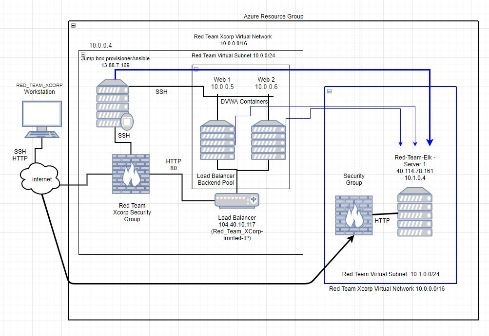
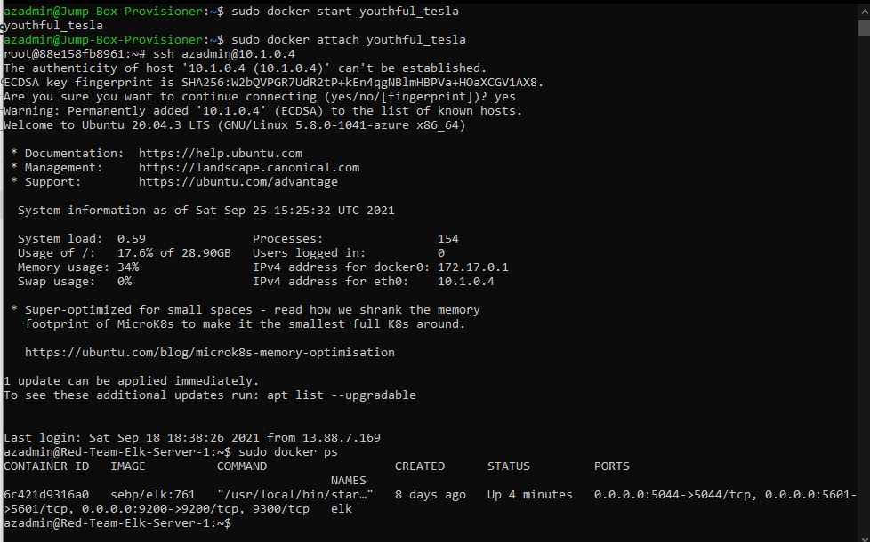

## Automated ELK Stack Deployment

The files in this repository were used to configure the network depicted below.

These files have been tested and used to generate a live ELK deployment on Azure. They can be used to either recreate the entire deployment pictured above. Alternatively, select portions of the yml file may be used to install only certain pieces of it, such as Filebeat.

  * **install-elk.yml**

This document contains the following details:
- Description of the Topologue
- Access Policies
- ELK Configuration
- Beats in Use
- Machines Being Monitored
- How to Use the Ansible Build

### Description of the Topology

The main purpose of this network is to expose a load-balanced and monitored instance of DVWA, the D*mn Vulnerable Web Application.

Load balancing ensures that the application will be highly availability, in addition to restricting traffic to the network.
-  What aspect of security do load balancers protect?
**Load balancer protects applications from threats and can authenticate user access**

 What is the advantage of a jump box?  **To manage and access devices in a separate security area or zone**

Integrating an ELK server allows users to easily monitor the vulnerable VMs for changes to the **Data** and system **Logs**.
-  What does Filebeat watch for?_ **Security data sources that simplify the collection, parsing, and visualization of common log formats down to a single command**
- What does Metricbeat record?_ **system-level CPU usage, memory, file system, disk IO, and network IO statistics**

The configuration details of each machine may be found below.
_Note: Use the [Markdown Table Generator](http://www.tablesgenerator.com/markdown_tables) to add/remove values from the table_.

| Name     | Function | IP Address | Operating System |
|----------|----------|------------|------------------|
| Jump-Box-Provisioner |Provisioner | 10.0.0.4 | Linux (ubuntu 20.04) |
| Web-1    |Webserver | 10.0.0.5   | Linux (ubuntu 20.04) |
| Web-2    |Webserver | 10.0.0.6   | Linux (ubuntu 20.04) |
| Red-Team-Elk-Server-1 | Elk Server | 10.1.0.4 |Linux (ubuntu 20.04)|

### Access Policies

The machines on the internal network are not exposed to the public Internet. 

Only the __Jump Box__ machine can accept connections from the Internet. Access to this machine is only allowed from the following IP addresses:**13.88.7.169**
- Add whitelisted IP addresses_**104.211.30.84, 13.88.7.169**

Machines within the network can only be accessed by __Elk Server__.
- Which machine did you allow to access your ELK VM? **Load Balancer** What was its IP address?**104.40.10.117 **

A summary of the access policies in place can be found in the table below.

| Name     | Publicly Accessible | Allowed IP Addresses |
|----------|---------------------|----------------------|
| Jump-Box-Provisioner | Yes                | 13.88.7.169    |
|Red-Team-Elk-Server-1 |Yes | 104.211.30.84 |

### Elk Configuration

Ansible was used to automate configuration of the ELK machine. No configuration was performed manually, which is advantageous because...
-  What is the main advantage of automating configuration with Ansible? **You can orchestrate the entire application environment no matter where it’s deployed.** 

The playbook implements the following tasks:

​       In 3-5 bullets, explain the steps of the ELK installation play. E.g., install Docker; download image; etc._

- **Create a new vNet in a new region within the resource group**
- **Create a Peer Network Connection between two vNets**
- **Download and Configure a Elk docker container**
- **Launch the elk docker container to start the elk server**

The following screenshot displays the result of running `docker ps` after successfully configuring the ELK instance.

### Target Machines & Beats
This ELK server is configured to monitor the following machines:
- **Web 1  10.0.0.5, Web 2  10.0.0.6**

We have installed the following Beats on these machines:
- **filebeat-7.4.0-amd64.deb,  metricbeat-7.6.1-amd64.deb**

These Beats allow us to collect the following information from each machine:
- **Filebeat consists of two main components: inputs and harvesters. for example, a log input check each file to see whether the a harvester needs to be started or if one already running.  A Harvester is responsible for reading the content of a single file. One harvester is started for each file. The harvester is responsible for opening and closing the file, which means that the file descriptor remains open while the harvester is running.** all info found on elastic.com
- **Metricbeat helps you monitor your servers by collecting metrics from the system and services running on the server, such as: Apache, HAProxy, MonogoDB, MySQL**   all info found on elastic.com

### Using the Playbook
In order to use the playbook, you will need to have an Ansible control node already configured. Assuming you have such a control node provisioned: 

SSH into the control node and follow the steps below:
- Copy the _____ file to _____
- Update the _____ file to include...
- Run the playbook, and navigate to ____ to check that the installation worked as expected.

_TODO: Answer the following questions to fill in the blanks:_
- _Which file is the playbook? Where do you copy it?_ **ansible stays in jumpbox,** **filebeat copies configuration file to  /etc/ansible/filebeat-config.yml,   metricbeat copies configuration file to  /etc/ansible/metricbeat-config.yml**
- Which file do you update to make Ansible run the playbook on a specific machine? **the Hosts file**, How do I specify which machine to install the ELK server on versus which to install Filebeat on?  **within the playbook, on line hosts**
- _Which URL do you navigate to in order to check that the ELK server is running?  http://104.211.30.84:5601/app/kibana#/home

